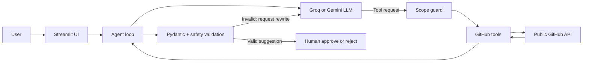

# GitHub Issue Triage Agent

A human-in-the-loop agent that reads public GitHub issues, searches related
repository code, and proposes labels plus a maintainer-ready draft response.

The application is deliberately read-only: it never comments on, labels, or
changes a GitHub repository.

[](https://shambhavi-issue-triage-agent.streamlit.app/)

**Live demo:** https://shambhavi-issue-triage-agent.streamlit.app/

## Why this project exists

Popular open-source repositories receive issues that must be understood,
categorized, and answered before engineering work begins. This project
automates that first-pass triage while keeping a human responsible for the
final decision.

## Features

- Tool-calling loop with `list_open_issues`, `get_issue`, and `search_code`
- Structured output containing labels, confidence, rationale, draft reply, and
  related files
- Editable human review with approval, rejection, and JSON download
- Full tool trace showing requested and actually executed arguments
- Repository and issue scope enforcement for every tool call
- Pydantic schema validation for untrusted AI output
- Draft safety checks that reject promises or false maintainer authority
- Friendly free-tier rate-limit handling
- Synthetic and public-issue evaluation benchmarks
- 29 automated tests that run without consuming API quota

## Architecture



The issue text, comments, repository content, tool arguments, and model output
are all treated as untrusted input.

## Technology

- Python
- Streamlit
- PyGithub
- Groq API (tested) with an optional Gemini adapter (not validated in this run)
- Pydantic
- pytest
- Local environment variables via `python-dotenv`

All services used by the MVP have a free option.

## Local setup

```bash
git clone https://github.com/shambhavichaurasia/github-issue-triage-agent.git
cd github-issue-triage-agent
python3 -m venv .venv
source .venv/bin/activate
pip install -r requirements.txt
cp .env.example .env
```

Add secrets to `.env`:

1. `GITHUB_TOKEN`: a personal token with only the minimum read-only access
   required for public repositories. Do not grant private-repository or write
   permissions.
2. Choose one free LLM provider:
   - Tested path: `LLM_PROVIDER=groq` and `GROQ_API_KEY`
   - Optional adapter: `LLM_PROVIDER=gemini` and `GEMINI_API_KEY`

`.env` is excluded from Git and must never be committed.

Run the app:

```bash
streamlit run app.py
```

Try `psf/requests` with issue `7627`.

## Testing

Install development dependencies and run all local tests:

```bash
pip install -r requirements-dev.txt
pytest -q
```

The test suite covers:

- unsafe and neutral draft replies
- structured JSON extraction
- repository-input validation
- strict triage-output schema validation
- repository and issue tool-scope enforcement
- evaluation parsing and scoring

## Evaluation

The app contains two reproducible label-classification benchmarks:

- **Synthetic cases:** eight clear, locally stored examples
- **Public cases:** eight traceable issues from `psf/requests` and
  `fastapi/fastapi`, using repository labels as expected answers

One observed run scored 8/8 on synthetic cases and 5/8 on public cases. The
public result is the more realistic baseline because repository labels can
encode maintainer conventions that are not obvious from issue text. Scores may
vary by model and run.

The public dataset can be refreshed with:

```bash
python -m evals.build_public_cases
```

## Project structure

```text
app.py                       Streamlit application
src/agent.py                 Agent loop, provider calls, and safety controls
src/github_tools.py          Read-only GitHub tools
src/models.py                Validated triage-output schema
src/evaluation.py            Benchmark runner and scoring
src/config.py                Environment configuration
evals/cases.json             Synthetic benchmark
evals/public_cases.json      Traceable public benchmark
evals/build_public_cases.py  Public dataset builder
tests/                       Offline automated tests
examples/                    Example output
```

## Current limitations

- Approval decisions exist only in the current browser session.
- The app suggests work but does not create patches or pull requests.
- Free LLM tiers can temporarily rate-limit requests.
- Public repository labels are not standardized across projects.

